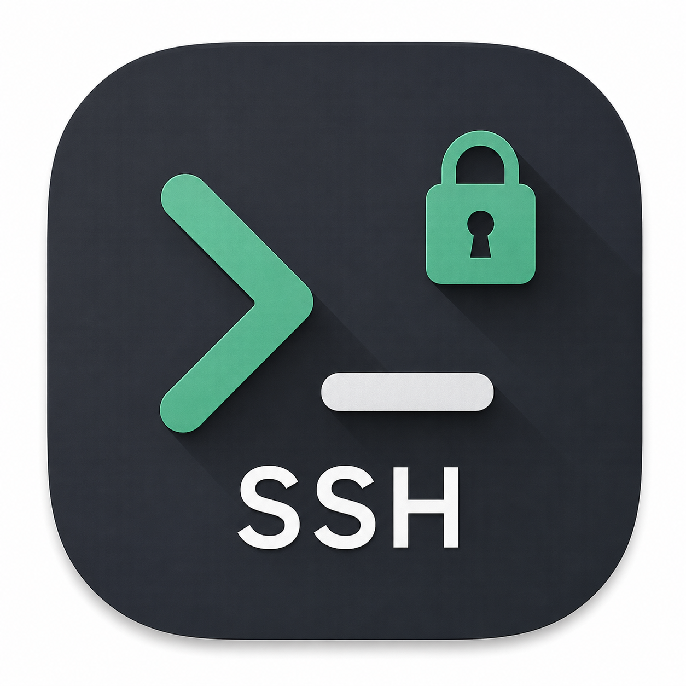

# ohmyssh

<p align="center">
  
</p>

<p align="center">
  <strong>A simple, reliable SSH/SFTP client on every platform you own.</strong>
  <br>
  Terminal, file browser, serial console, LAN scan and an encrypted vault of
  systems and users — one codebase, five platforms.
</p>

<p align="center">
  
  
  
  
  
</p>

Keep every system you connect to in one encrypted vault, open a shell or an
SFTP browser on any of them, and get the same app on your phone, your laptop
and your desktop.

> SSH does not work on iOS yet — the native transport is still being wired up,
> so a connect attempt there fails with a clear reason. Serial is desktop and
> Android only: iOS has no path to a USB adapter.

## Highlights

- **One encrypted vault for everything** — systems, users, passwords, private keys and host key pins in a single `ohmyssh.vault` file: PBKDF2-HMAC-SHA256 over 120 000 rounds, AES-256-GCM.
- **Systems and users kept apart** — a user holds a login plus its password or key, systems point at one, so a rotated credential is edited once. Groups become sections on the systems list.
- **Host keys pinned on first connect** — OpenSSH-style `SHA256:<base64>` fingerprints stored in the vault; a changed key stops the connection instead of shrugging.
- **A real terminal** — VT100/xterm emulation with 10 000 lines of scrollback, alternate screen and full attribute and colour handling.
- **Sessions as panes** — several live sessions at once, split into two windows, each showing a shell, an SFTP browser or the local filesystem.
- **SFTP that works like a file manager** — browse, upload, download, rename, delete, mkdir, multi-select, progress and cancel, plus a text editor that saves straight back to the server.
- **Command history without a keylogger** — commands are read off the screen when Enter lands, so line editing, history recall and pastes are already resolved; anything the shell chose not to echo is never recorded.
- **LAN sweep** — ping and ARP the local network and stream in hosts, IPs, MACs and round-trip times as they answer, then connect to one straight from the table.
- **Serial console** — saved devices with baud, data bits, parity, stop bits, flow control and DTR/RTS, pinned to a physical adapter by USB vendor, product and serial number.
- **Auto-unlock** — the master password goes into the platform keystore (Keychain, Android Keystore, desktop keychains) when you ask for it, and nowhere else.

## Feature tour

| Area | What it does |
| --- | --- |
| Systems | Saved hosts with port, user, group, notes and a pinned host key; connect over SSH or open straight into SFTP. |
| Users | Reusable identities — a login plus password or private key, passphrase included. |
| Sessions | Every open connection in one list, split panes, reconnect, close one or close all. |
| Terminal | VT100/xterm emulation, scrollback, alternate screen, keyboard and paste handling. |
| Files | Remote SFTP and the local filesystem side by side, transfers with progress, text editor with binary and size guards. |
| Network | LAN scan into a sortable table of host, IPv4/IPv6, MAC and ping, with saved systems and this device marked. |
| Serial | USB serial devices with their full line settings, remembered per adapter. |
| History | Past connections with duration and outcome, and the commands run over each of them. |
| System info | Load, CPU count and usage, memory, disk and uptime, probed over the live session. |
| Settings | Theme, startup behaviour, auto-unlock, master password change, vault and history import/export, delete. |

## Vault

One file holds everything, and it lives where the platform keeps app data:

* macOS: `~/Library/Application Support/com.example.ohmyssh/ohmyssh.vault`
* Linux: `$XDG_DATA_HOME/com.example.ohmyssh/ohmyssh.vault`
* Windows: `%APPDATA%\com.example\ohmyssh\ohmyssh.vault`
* Android/iOS: the app's private files / Application Support directory

Settings can export an encrypted copy of the vault or the history, import one
back, change the master password (the vault is re-encrypted in place) or delete
everything.

## Install

Take the asset for your platform from the **Releases** page:

| Asset | Platform |
| --- | --- |
| `ohmyssh_<version>_android_universal.apk` | Android — signed release APK, no ABI splits |
| `ohmyssh_<version>_ios_arm64.ipa` | iOS — unsigned IPA |
| `ohmyssh_<version>_linux_x64` | Linux — self-extracting executable, bundled runtime |
| `ohmyssh_<version>_macos_arm64.dmg` | macOS — drag-to-Applications DMG |
| `ohmyssh_<version>_windows_x64.exe` | Windows — self-extracting executable, bundled runtime |
| `ohmyssh_<version>_windows_x64_raw.zip` | Windows — the same app image, unwrapped |

If macOS reports the app as damaged or quarantined, clear the attribute:

```bash
sudo xattr -dr com.apple.quarantine /Applications/ohmyssh.app
```

## License

ohmyssh is licensed under the
[PolyForm Noncommercial License 1.0.0](./LICENSE.md).

Personal projects, hobby use, research, education and noncommercial
organizations are all permitted. Commercial use is not — get in touch if that is
what you need.
